# HR People Analytics — Attrition & Retention

[](https://github.com/KushPatel29/hr-attrition-analytics/actions/workflows/ci.yml)


A **SQL-first** people-analytics mart that answers the questions an HR
leadership team actually asks: *Who is leaving, and why? Are we paying people
fairly? Is our hiring funnel healthy? Which of our current employees are most
likely to quit next?* The analytics live in **hand-written SQL** (window
functions, CTEs, cohort survival, level-adjusted pay gaps), run end-to-end
locally with **zero database setup** via SQLite, are surfaced in an
interactive **6-page Power BI dashboard**, and are extended with an
**explainable flight-risk model**.

Everything is synthetic (Faker, fixed seeds — no real employee data), but the
logic and dashboard mirror real workforce-analytics work. CI re-runs the whole
pipeline and 27 tests on every push.

## Headline findings (from the generated snapshot, 2026-06-30)

| Metric | Value |
|--------|-------|
| Active headcount | **1,483** |
| Trailing-12-month attrition | **19.4%** (73% voluntary) |
| Level-adjusted gender pay gap | **3.3%** — small but present in **all 8 levels** |
| Applied → Hired conversion | **8.8%** · median time-to-fill **48 days** |
| Flight-risk model | ROC-AUC **0.736**, top-decile lift **2.4×** (beats 0.500 baseline) |

The full write-up with the "so what" behind each number is in
[`docs/INSIGHTS.md`](docs/INSIGHTS.md).

## Why SQL-first

The heart of this project is [`sql/`](sql/) — seven files that do the real
analytical work, written to run **as-is on SQLite** (so the repo is runnable
by anyone) while reading as clean T-SQL for SQL Server / Microsoft Fabric.
A few of the techniques on show:

- **Point-in-time headcount** reconstructed from hire/termination dates, then a
  windowed trailing-12-month attrition rate
  ([`02_workforce_kpis.sql`](sql/02_workforce_kpis.sql)).
- **Cohort survival** — a retention triangle that correctly handles
  right-censoring by only counting employees who *had the opportunity* to reach
  each tenure milestone ([`04_retention_cohorts.sql`](sql/04_retention_cohorts.sql)).
- **Level-adjusted pay gap** — separating a real within-level pay difference
  from the mix effect of men and women sitting at different levels
  ([`05_pay_equity.sql`](sql/05_pay_equity.sql)).

```sql
-- 04_retention_cohorts.sql (excerpts): survival that respects censoring
by_cohort AS (
    SELECT
        CAST(cohort_year AS TEXT) AS cohort_year,
        months_since_hire,
        SUM(CASE WHEN opportunity_months >= months_since_hire THEN 1 ELSE 0 END) AS eligible,
        SUM(CASE WHEN opportunity_months >= months_since_hire
                  AND tenure_months      >= months_since_hire THEN 1 ELSE 0 END) AS retained
    FROM cohort_grid
    GROUP BY cohort_year, months_since_hire
)
...
    /* month-over-month drop within a cohort, via LAG */
    ROUND(1.0 * retained / NULLIF(eligible, 0)
          - LAG(1.0 * retained / NULLIF(eligible, 0))
              OVER (PARTITION BY cohort_year ORDER BY months_since_hire), 4) AS retention_delta
```

The runnable engine [`engine/run_hr_analytics.py`](engine/run_hr_analytics.py)
loads the CSVs into in-memory SQLite, **executes those SQL files verbatim**,
and writes the result tables the dashboard and model consume — so what you read
in `sql/` is exactly what runs.

## The analysis

**Attrition by department** — where the churn actually is:

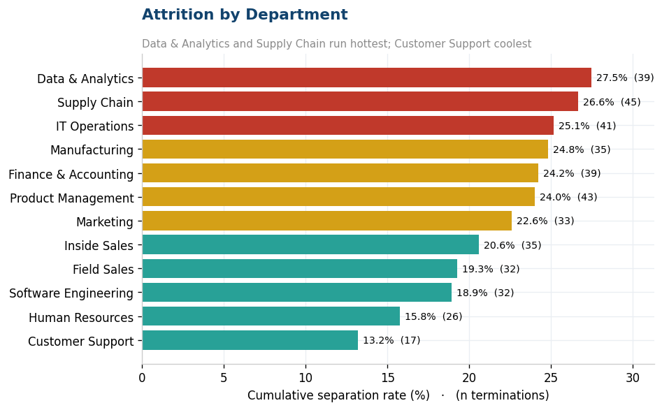

**Hire-cohort retention** — the first 18 months are where people leave:

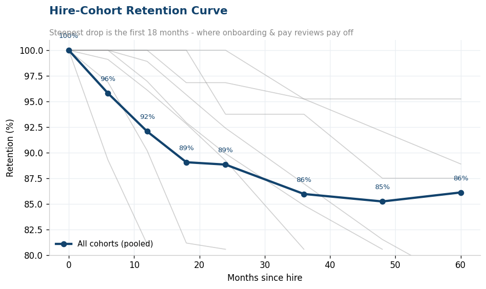

**Gender pay gap, raw vs level-adjusted** — the honest finding is that a small
gap favoring men shows up in *every* level, so it survives adjustment:

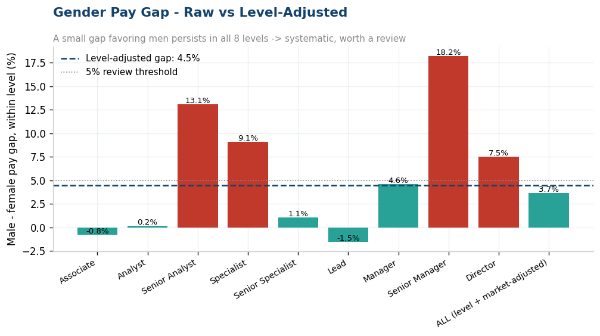

**12-month headcount bridge** and **recruiting funnel**:

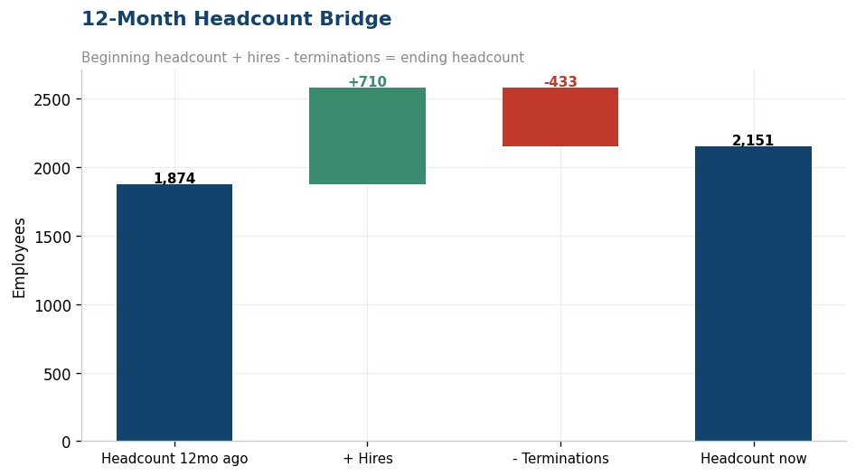
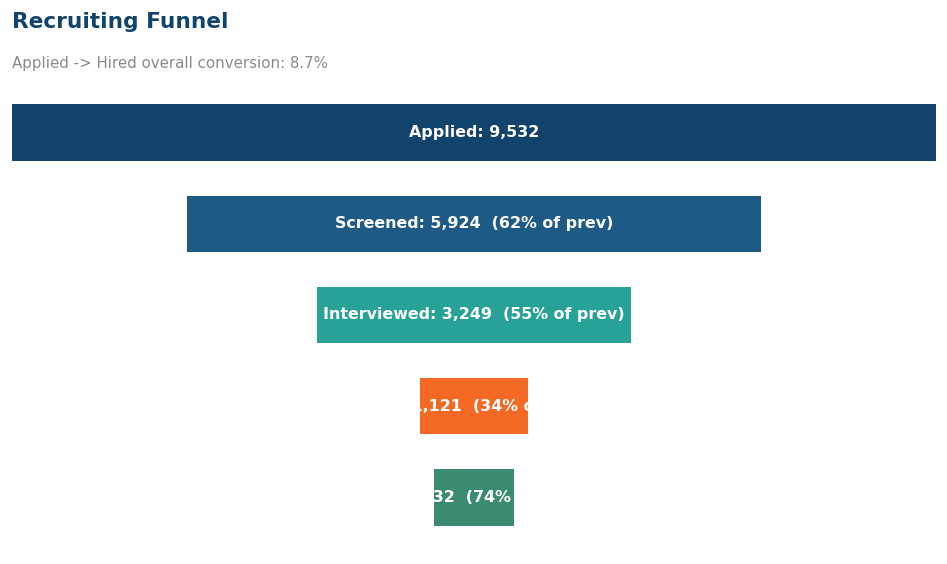

**What drives flight risk** — the model's own weights, dominated by tenure and
pay-relative-to-peers (the drivers really do predict who left):

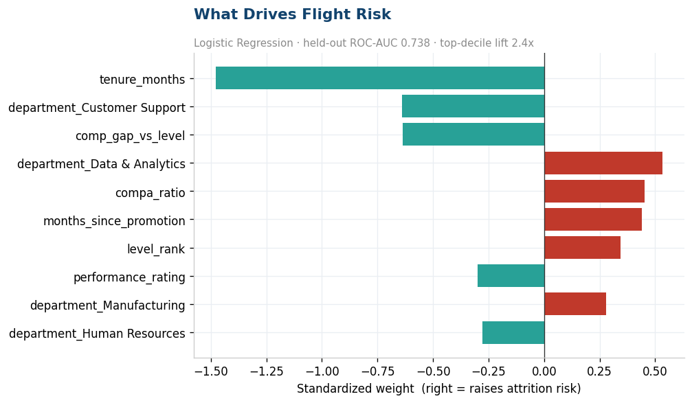

## The flight-risk model

An honest three-way bake-off ([`ml/attrition_model.py`](ml/attrition_model.py))
on a held-out 30% of employees:

| Model | ROC-AUC | PR-AUC | Lift @ top 10% |
|-------|:------:|:-----:|:-----:|
| Baseline (prevalence) | 0.500 | 0.219 | 1.4× |
| **Logistic Regression (shipped)** | **0.736** | 0.441 | **2.4×** |
| Random Forest | 0.730 | 0.478 | 2.4× |

Logistic regression is shipped over the (essentially tied) random forest
because a retention score a business partner has to defend needs **per-employee
reasons**, not a black box — each high-risk employee gets a plain-English driver
(*"early tenure"*, *"paid below level peers"*, *"overdue for promotion"*). A
[pytest gate](tests/test_ml_model.py) fails the build if the shipped model ever
stops beating the baseline or drops below 0.68 AUC.

## The dashboard

A 6-page interactive Power BI report, hand-authored as a Power BI Project
(TMDL model + PBIR definition) in [`powerbi/pbip/`](powerbi/pbip/) — open
`HRAttritionAnalytics.pbip` in Power BI Desktop and Refresh
([build guide](powerbi/BUILD_GUIDE.md)). 53 visuals across 6 pages, styled with
the shared Meridian Corporate theme. Screenshots below are the live report
rendered in Power BI Desktop against the pipeline outputs.

**Workforce Scorecard** — KPI cards, attrition gauge vs target, headcount trend,
and a 12-month **waterfall** bridge (begin + hires − terms = end):

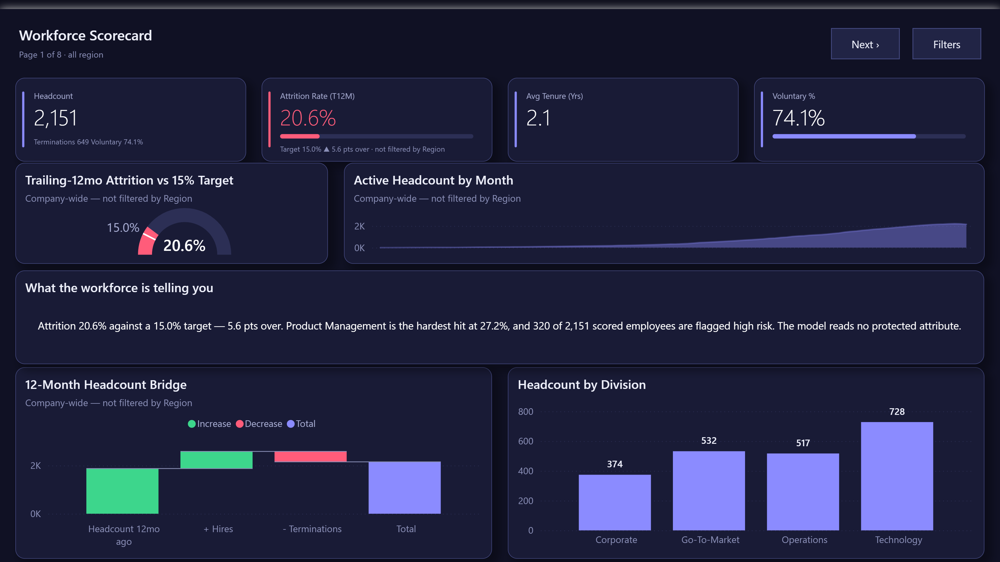

**Attrition Deep-Dive** — rate by department, voluntary/involuntary **donut**,
exits-by-level **treemap**, rolling-attrition trend, and the early-tenure risk
spike:

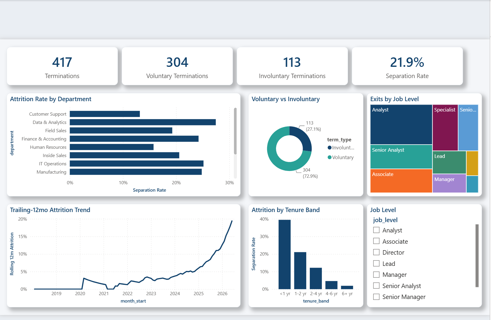

**Retention & Cohorts** — cohort survival curves and the **retention-triangle
matrix** (each hire-year cohort's % retained at each tenure milestone):

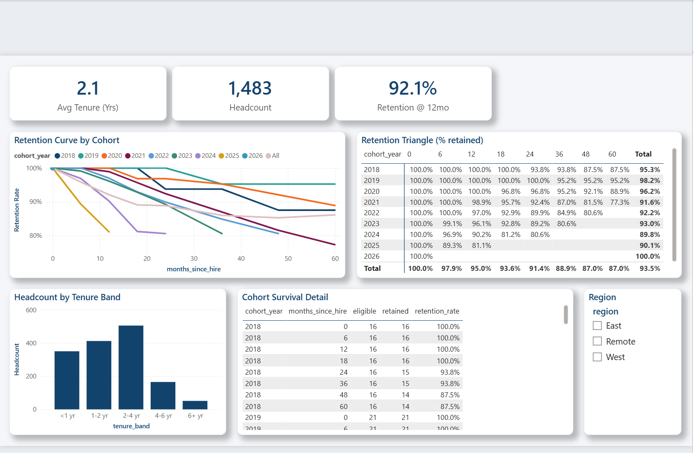

**Pay Equity** — compa-ratio gauge, salary-by-gender columns, a **scatter**, and
the per-level gap table straight from the SQL:

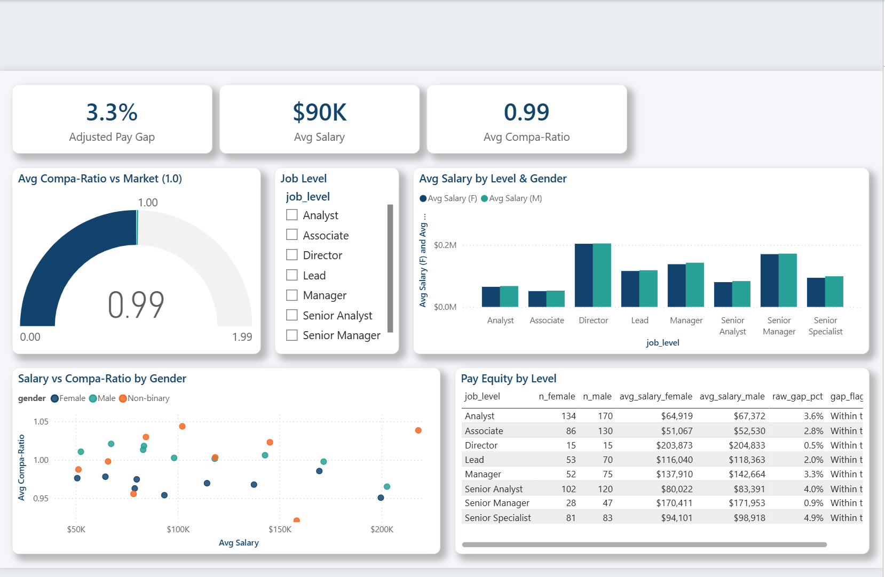

**Recruiting Funnel** — the hiring **funnel**, hire-rate and time-to-fill by
source, and a source scorecard:

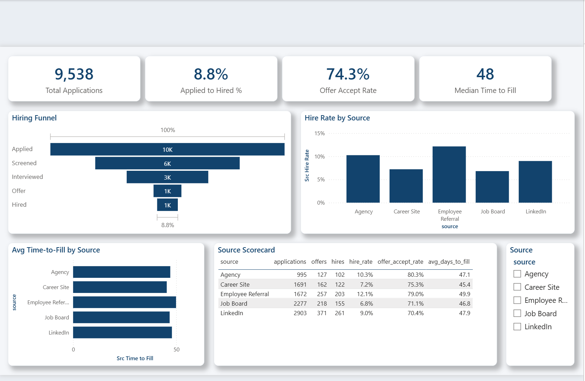

**Flight Risk (ML)** — high-risk **treemap**, risk-band mix, a tenure ×
engagement **scatter** (the high-risk cluster sits at low tenure / low
engagement), and an actionable **retention watch list** with per-employee
reasons:

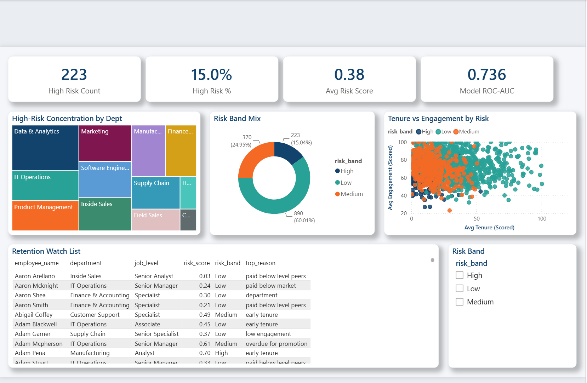

## Architecture

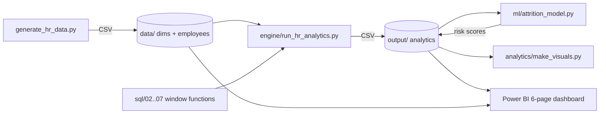

## Repo layout

```
hr-attrition-analytics/
├── data_generator/   generate_hr_data.py  (Faker, seeded star schema)
├── data/             dimensions + employee master + applications (CSV)
├── sql/              01 schema DDL + 02..07 analytics (window functions, CTEs)
├── engine/           run_hr_analytics.py  (SQLite executes the SQL end-to-end)
├── ml/               attrition_model.py   (bake-off, scores, explainability)
├── analytics/        make_visuals.py      (README figures)
├── output/           SQL + ML results consumed by Power BI
├── docs/             rendered figures + INSIGHTS.md (findings write-up)
├── powerbi/          pbip/ (TMDL + PBIR), screenshots/, dax_measures.dax, BUILD_GUIDE.md
└── tests/            data / SQL / ML / Power BI-integrity invariants
```

## Run it

```bash
pip install -r data_generator/requirements.txt
python data_generator/generate_hr_data.py   # synthetic HR data
python engine/run_hr_analytics.py           # execute the SQL, write outputs
python ml/attrition_model.py                # train + score flight risk
python analytics/make_visuals.py            # render the figures
pytest tests/ -v                            # 27 invariants
```

Then open `powerbi/pbip/HRAttritionAnalytics.pbip` in Power BI Desktop.

## Notes

- **Synthetic data.** Attrition is generated from a latent logistic model of
  real drivers (tenure, engagement, pay-vs-market, promotion stagnation,
  overtime, commute), so the SQL has genuine signal to quantify and the ML
  model has something honest to learn.
- **Demographic fields** (`gender`, `ethnicity_group`) exist only to
  demonstrate pay-equity and DEI analysis technique on fictional data.
