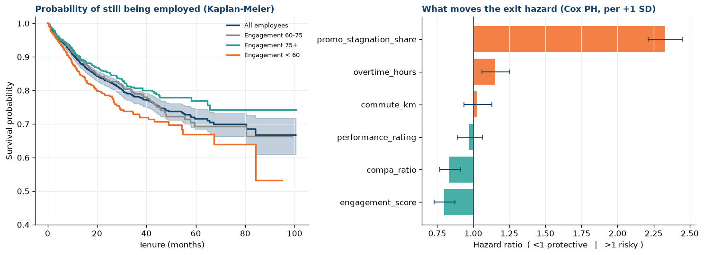
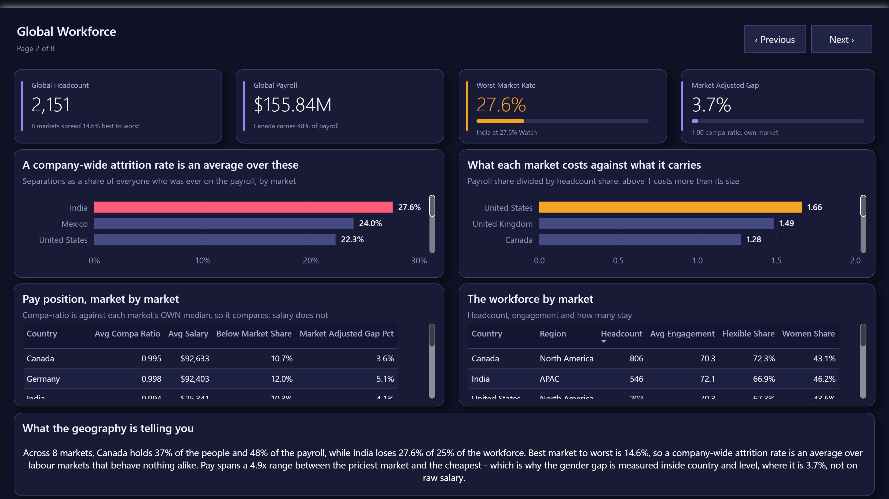
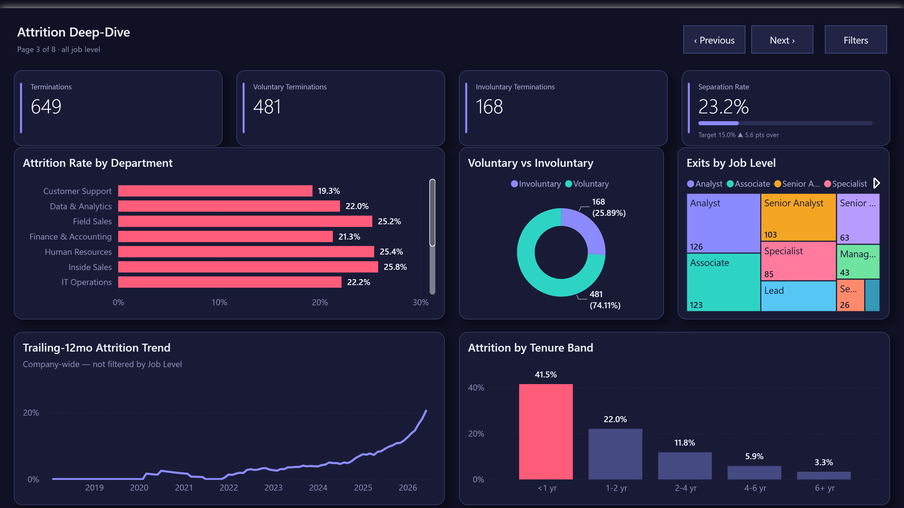
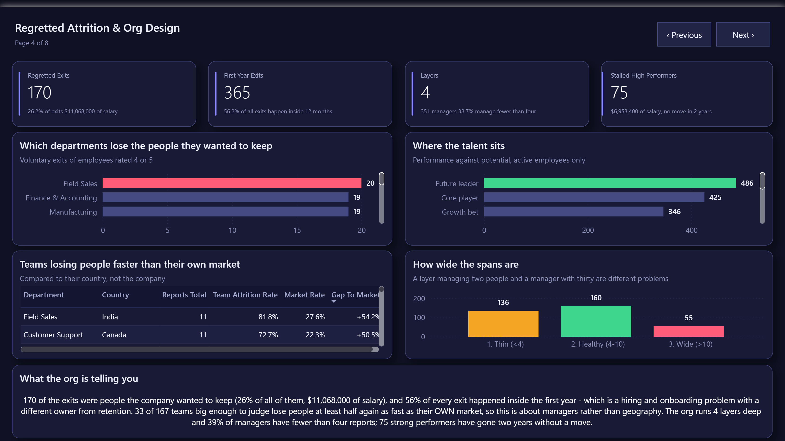
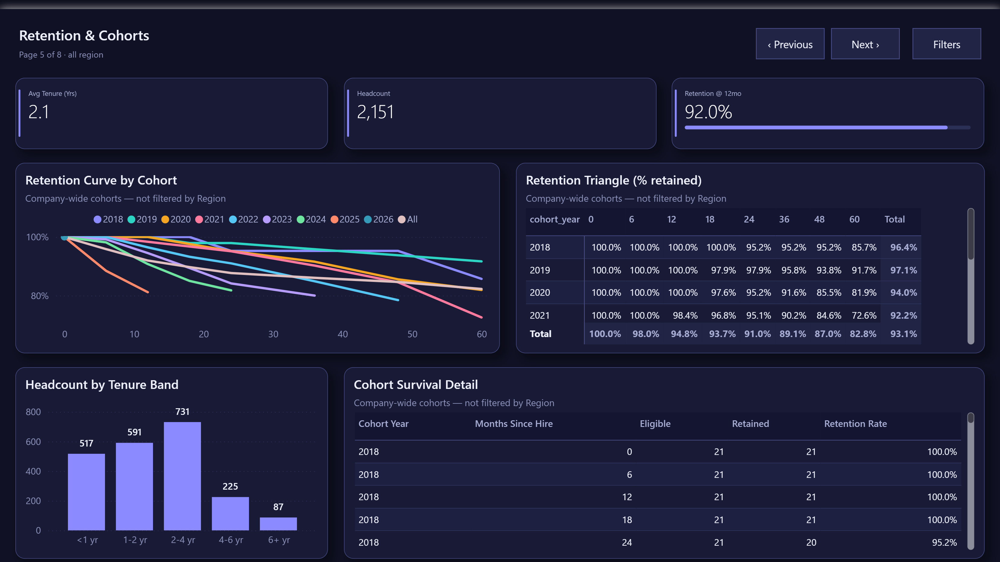
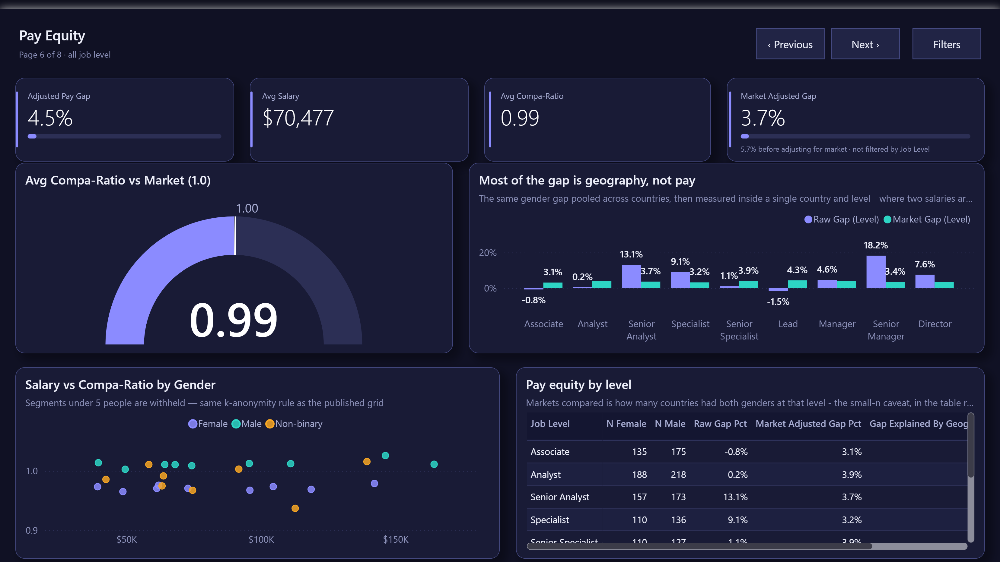
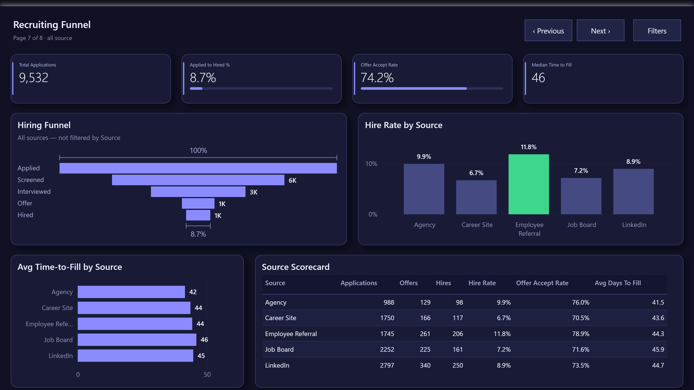
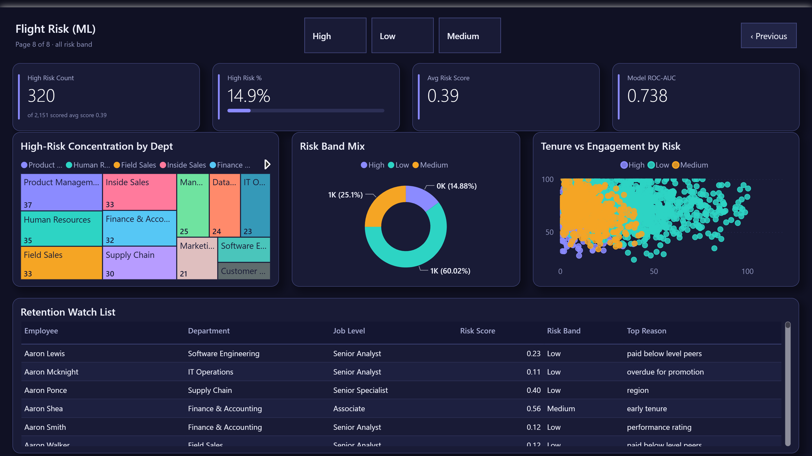
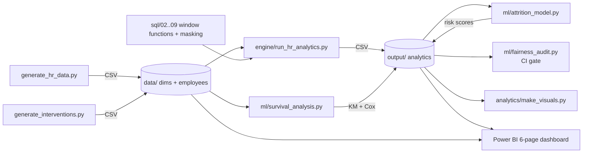

# HR People Analytics — Attrition & Retention

[](https://github.com/KushPatel29/hr-attrition-analytics/actions/workflows/ci.yml)


Every HR leadership meeting circles the same four questions: *who is leaving,
and why? Are we paying people fairly? Is the hiring funnel healthy? Which of
our current employees will quit next?* A multinational adds three more that a
single-country dashboard cannot even frame: *which of those leavers did we
actually want to keep? Does attrition follow the market or the manager? And is
that pay gap a pay decision, or the exchange rate?* This project answers all
seven with a **SQL-first** people-analytics mart — the analytics are hand-written SQL
(window functions, CTEs, cohort survival, level-adjusted pay gaps) that a
reviewer can read and audit, executed verbatim by a small Python engine, and
surfaced in an **8-page Power BI dashboard** plus an **explainable
flight-risk model**. The workforce is 2,800 people across **14 sites in 8
countries**, because every one of those extra three questions is invisible
in a single market.

But there's a fifth question that people-analytics work has to answer before
any of the others matter: *can this system be trusted with data about
people?* Compensation, gender, ethnicity, a score predicting whether someone
quits — this is the most sensitive data a company holds. So the pipeline also
ships the guardrails: **k-anonymity masking** so no dashboard filter can
corner a single person's salary, a **fairness audit** that breaks the build
on statistically significant disparate impact, **survival analysis** that
treats time honestly instead of averaging over it, and an **intervention
log** that measures whether retention actions actually worked.

Everything is synthetic (Faker, fixed seeds — no real employee data), but the
logic mirrors real workforce-analytics practice. CI re-runs the whole
pipeline and all 482 tests on every push.

## Headline findings (from the generated snapshot, 2026-06-30)

| Metric | Value |
|--------|-------|
| Active headcount | **2,151** across **8 countries**, 14 sites |
| Trailing-12-month attrition | **20.6%** — but **14.5 points** separate the best market from the worst |
| Largest market | **Canada** — 37% of the people, **48%** of the payroll |
| Fastest-churning market | **India** — 27.6% attrition on **25%** of the workforce |
| Regretted exits | **170** (26% of all exits), **$11.1M** of salary |
| First-year exits | **56% of every exit** happens inside 12 months |
| Gender pay gap | **4.5%** level-adjusted, **3.7%** once market is held constant |
| Teams above their own market | **33 of 167** teams with 8+ reports |
| Org shape | **4 layers**, 351 managers, **39%** managing fewer than four people |
| Flight-risk model | ROC-AUC **0.738**, top-decile lift **2.5x** — with zero protected attributes |
| Strongest exit hazard (Cox) | promotion stagnation, **HR 2.3 per +1 SD** |
| Retention interventions | **+14.8 pts** retention among treated at-risk employees (planted effect — see caveat) |

The full write-up with the "so what" behind each number is in
[`docs/INSIGHTS.md`](docs/INSIGHTS.md).

## Why SQL-first

The heart of this project is [`sql/`](sql/) — eight analytics files that do
the real work, written to run **as-is on SQLite** (so the repo is runnable by
anyone, no database setup) while reading as clean T-SQL for SQL Server /
Microsoft Fabric. A few of the techniques on show:

- **Point-in-time headcount** reconstructed from hire/termination dates, then a
  windowed trailing-12-month attrition rate
  ([`02_workforce_kpis.sql`](sql/02_workforce_kpis.sql)).
- **Cohort survival** — a retention triangle that correctly handles
  right-censoring by only counting employees who *had the opportunity* to reach
  each tenure milestone ([`04_retention_cohorts.sql`](sql/04_retention_cohorts.sql)).
- **Level-adjusted pay gap** — separating a real within-level pay difference
  from the mix effect of men and women sitting at different levels
  ([`05_pay_equity.sql`](sql/05_pay_equity.sql)).
- **Small-cell suppression** with the two-cell rule, so segment metrics can be
  published without a subtraction attack recovering the hidden cell
  ([`08_privacy_masking.sql`](sql/08_privacy_masking.sql)).

```sql
-- 04_retention_cohorts.sql (excerpts): survival that respects censoring
by_cohort AS (
    SELECT
        CAST(cohort_year AS TEXT) AS cohort_year,
        months_since_hire,
        SUM(CASE WHEN opportunity_months >= months_since_hire THEN 1 ELSE 0 END) AS eligible,
        SUM(CASE WHEN opportunity_months >= months_since_hire
                  AND tenure_months      >= months_since_hire THEN 1 ELSE 0 END) AS retained
    FROM cohort_grid
    GROUP BY cohort_year, months_since_hire
)
...
    /* month-over-month drop within a cohort, via LAG */
    ROUND(1.0 * retained / NULLIF(eligible, 0)
          - LAG(1.0 * retained / NULLIF(eligible, 0))
              OVER (PARTITION BY cohort_year ORDER BY months_since_hire), 4) AS retention_delta
```

The runnable engine [`engine/run_hr_analytics.py`](engine/run_hr_analytics.py)
loads the CSVs into in-memory SQLite, **executes those SQL files verbatim**,
and writes the result tables the dashboard and model consume — so what you read
in `sql/` is exactly what runs.

## The analysis

**Attrition by department** — where the churn actually is:


**Hire-cohort retention** — the first 18 months are where people leave:


**Gender pay gap, raw vs level-adjusted** — pooled across countries the
per-level gaps swing from −1.5% to +18%, which is mostly the geographic mix of
who sits where; held inside country and level they collapse to a consistent
3-4%, and *that* is the number a review should act on:


**12-month headcount bridge** and **recruiting funnel**:


**Survival curves and exit hazards** — engagement bands separate cleanly, and
the Cox model quantifies each driver (details in the next section):



**What drives flight risk** — the model's own weights (the drivers really do
predict who left):


## Three questions a single-country dashboard cannot frame

The workforce spans 14 sites in 8 countries, each with its own labour market.
That is not decoration: it changes what several of the standard metrics *mean*,
and three of them stop working entirely.

### "Women earn 4.5% less" — of which most is the exchange rate

Pay is set against the **local** market, and the priciest of the eight costs
**4.9x** the cheapest, so a Bengaluru Senior Analyst and a New York Senior
Analyst — both paid correctly at their own median — differ by roughly that
much. Any gender split that happens to sit differently across those markets
therefore reads as a pay gap that has nothing to do with pay decisions. Pooled
within-level, Senior Manager comes out at **18.2%**; measured inside a single
country and level, it is **3.4%**. The difference is geography, and the column
that says so is in the table rather than a footnote:

| | Pooled across countries | Inside country x level |
|---|---|---|
| Company | 4.5% | **3.7%** |
| Senior Manager | 18.2% | 3.4% |
| Senior Analyst | 13.1% | 3.7% |
| Lead | −1.5% | 4.3% |

Compa-ratio, unlike salary, *is* comparable across markets — every country
sits at 0.99 of its own median — so the page reports position against the local
benchmark and keeps raw salary for the budgeting question it belongs to.

The benchmark table is keyed on **(country, level)** and the join uses both.
Keying it on level alone was not a rounding error: two job titles share level
rank 3, so de-duplicating on rank left `Specialist` with no benchmark row at
all and an INNER JOIN silently dropped every Specialist from the pay analysis.
The test that reconciles the roll-up headcount against the active population is
what caught it.

### An attrition rate treats a managed-out low performer as a loss

It is not one. Splitting exits three ways — **regretted** (voluntary, rated
4-5), **non-regretted** (involuntary, or voluntary at 1-2) and **neutral**
(voluntary at 3) — separates the departures that hurt from the ones that were
the point. **170 exits, 26% of the total and $11.1M of salary**, were people
the company wanted to keep. Salary, not a replacement-cost multiple: there is
no recruiting-cost or ramp data here, and a made-up multiplier turns a
measurement into an opinion.

The same split surfaces the finding that reassigns the problem entirely:
**56% of all exits happen inside the first year.** That is a hiring and
onboarding failure, with a different owner and a different fix from anything in
a retention budget.

### Attrition clusters under managers — and proving it took two controls

Teams differ. **33 of the 167 teams with 8 or more reports** lose people at
least half again as fast as their **own market**. The company rate is the wrong
comparison: ranking every team against it just produces a list of countries
wearing managers' names.

Even then, "it is the manager" is easy to assert and hard to earn. The claim is
held to a permutation test, and that test passed with the manager effect
**switched off** twice before it was right:

* **shuffling globally** let geography leak in — managers are recruited
  locally, so a team sits in one market, and markets here churn between 12% and
  28%;
* **shuffling within a market** still let seniority leak in — a manager's
  reports sit below them, so a Director's team is managers and a Manager's team
  is juniors, and tenure is the model's strongest driver.

Permuting inside (country x level) cells holds both fixed. What still clusters
by team after that is the manager, and the assertion now fails if the effect is
removed from the generator.

### And an org chart has to be a chart, not a loop

The reporting graph is acyclic by construction — a manager always sits at a
strictly higher level than their report — because the first version drew
managers from a same-department pool that included their own peers. Two
managers ended up managing each other, the recursive walk up the chain ran
until its loop guard, and **every employee was reported as sitting 12 layers
deep**. It rendered. It was even plausible. The test walks the graph explicitly
rather than trusting the query that consumes it, since the loop guard would
have hidden the cycle from both.

The org is **4 layers** with 85% of people at the base, 351 managers, and
**39% of them managing fewer than four people** — a layer that exists to manage
two.

### What this deliberately does not compute

**Cost of attrition in dollars.** Recruiting spend, agency fees and
productivity ramp are not in this data, and a "1.5x salary" rule of thumb
borrowed from a blog post is an opinion wearing a number's clothes. Salary at
risk is a fact; cost of attrition here would not be.

**Currency conversion.** Salaries are already expressed on one scale, and no FX
series exists to convert anything with. The salary index is a labour-market
level, not an exchange rate, and the README says so rather than letting the
reader assume otherwise.

**Internal mobility rate.** There is no transfer or requisition-fill history
tying a leaver to an internal replacement, so promotion velocity is reported
from `months_since_promotion` and internal fill rate is not reported at all.


## The flight-risk model

An honest three-way bake-off ([`ml/attrition_model.py`](ml/attrition_model.py))
on a held-out 30% of employees:

| Model | ROC-AUC | PR-AUC | Lift @ top 10% |
|-------|:------:|:-----:|:-----:|
| Baseline (prevalence) | 0.500 | 0.219 | 1.4× |
| **Logistic Regression (shipped)** | **0.738** | 0.452 | **2.4×** |
| Random Forest | 0.731 | 0.476 | 2.7× |

Logistic regression is shipped over the (essentially tied) random forest
because a retention score a business partner has to defend needs **per-employee
reasons**, not a black box — each high-risk employee gets a plain-English driver
(*"early tenure"*, *"paid below level peers"*, *"overdue for promotion"*). A
[pytest gate](tests/test_ml_model.py) fails the build if the shipped model ever
stops beating the baseline or drops below 0.68 AUC.

One design decision worth pausing on: an earlier version of this model
included gender and age band as features, because they were columns and
columns become features if nobody stops them. Removing every protected
attribute moved held-out AUC from 0.736 to **0.738** — that is, the model
never needed to know who people are, only what their situation is. The
fairness audit below exists to verify the same thing holds at the *output*.

## Working with data about people

This is the part of people analytics that doesn't show up in a tutorial, and
it's where this version of the repo went. Four guardrails, each tested in CI.

### 1. A dashboard filter should never corner one person

Filter a comp dashboard to `Finance × Level 8 × Female` and, somewhere in
that grid, you're reading one individual's salary. [`08_privacy_masking.sql`](sql/08_privacy_masking.sql)
applies **k-anonymity (K=5)** to every department × level × gender segment
before it can be published. The subtle part is *complementary suppression*:
hiding only the small cell doesn't work, because group total minus the
visible cells equals the "hidden" one. The blunt fix — suppress the whole
group — destroyed 72% of this grid when I tried it, because every Non-binary
cell is small. The **two-cell rule** used by statistical agencies (always
suppress at least two cells, so subtraction only ever recovers a blend) keeps
97 of 239 cells publishable while making every suppressed cell unrecoverable.
A [suppression audit table](sql/08_privacy_masking.sql) records what was
withheld and why — keys only, no metrics, so the audit itself leaks nothing.

That covered the grid the SQL publishes. It did not cover the dashboard, which
is what the sentence above actually promises. The Power BI model averaged
`base_salary` with nothing in front of it, and the pay equity page plots that
average by job level and gender: one of its 27 bubbles was Director ×
Non-binary, **n = 1**, sitting at exactly $190,000. Cross-filter a department
and 41 of the 275 cells are single people. The guardrail was real and the
report walked around it.

The floor is now in the model as well — `Avg Salary`, `Avg Compa-Ratio` and
`Avg Engagement` return blank below K, so it applies to any segment a reader
assembles rather than only the one computed in advance. The two are not the
same thing and the difference is worth stating: **the DAX floor is primary
suppression only.** The two-cell rule needs to see the whole grid at once and a
measure only ever sees the cell it is in, so complementary suppression stays in
the SQL. [`tests/test_dashboard_k_anonymity.py`](tests/test_dashboard_k_anonymity.py)
holds the two thresholds equal and proves the floor fires on this data —
without that last check the guard could pass while protecting nothing.

### 2. Bias is a build break, not a slide in a deck

[`ml/fairness_audit.py`](ml/fairness_audit.py) runs after every scoring pass
and checks the **high-risk selection rate** for every gender, ethnicity, and
age group against the reference group — the disparate-impact ratio, screened
with the **four-fifths (80%) rule** from US employment practice. On this data
the screen genuinely fires: the 55+ band comes out at DI 1.33, one ethnicity
group at 0.77. The next step is what separates an audit from an alarm:
EEOC guidance says small-sample disparities need a significance test before
they count, and Fisher's exact test puts both groups at p ≈ 0.23. That is the
point where it is tempting to write "noise, not signal", and this README said
exactly that until a reviewer pushed back. It does not follow: a
non-significant result on a group this size means the sample cannot resolve
the question, not that the disparity is absent. What can honestly be said is
that the ratio is outside the band, the evidence for it is inconclusive here,
and the underlying attrition base rates are flat. So both land on a
**monitor list** rather than failing the build — and the ratio stays published
with its sample size beside it, because a screen you cannot clear is not the
same as a screen that passed. A group outside the band
*with* statistical significance exits non-zero and CI goes red; the test
suite proves the gate fires by planting a genuinely biased score and
watching it fail.

### 3. "When do people leave" is a different question from "who"

The retention triangle shows historic drop-off; the risk model ranks people.
[`ml/survival_analysis.py`](ml/survival_analysis.py) answers the planner's
question — how long does a cohort survive — with **Kaplan-Meier curves**
(event = voluntary exit; actives and dismissals are *censored*, not treated
as survivors-forever) and a **Cox proportional-hazards model** for the
drivers. Median survival is never reached at ~16% voluntary attrition, so
the honest headline is **t25**: a cohort with engagement below 60 loses a
quarter of its people by month 33, the 60–75 band by month 42, and the 75+
band not within the observation window at all.

The Cox fit also caught a trap worth telling: raw `months_since_promotion`
came out *protective* (HR 0.78, p < 1e-4) — backwards, and mechanically so,
because someone who left at month 12 can't be 30 months past a promotion.
The covariate was capped by tenure and proxying for survival itself.
Normalizing to *share of tenure without promotion* recovers the real,
planted effect: **HR 2.4 per +1 SD**, the strongest hazard in the model.
Cross-sectional covariates lie to survival models; that's the first thing
to fix with real HRIS event history.

### 4. A risk score nobody acts on is a report, not a system

`data/fact_hr_interventions.csv` is a synthetic log of retention actions
(stay interviews, out-of-cycle raises, development plans) taken on at-risk
employees, and [`09_intervention_effectiveness.sql`](sql/09_intervention_effectiveness.sql)
closes the loop: treated at-risk employees retain at **88.6%** vs **76.5%**
for the untreated — a **+12.1 point** lift, recovered by the SQL with three
choices that each change the answer if skipped (compare within the at-risk
cohort only; exclude dismissals; drop employees who never had the runway to
receive an intervention, or short-tenure quitters stack the control group).

**The caveat, stated plainly:** the effect is *planted by the generator*,
and even on real data this comparison is descriptive, not causal — HR
hand-picks who gets a stay interview, so the treated group is selected, not
randomized. The analysis demonstrates the mechanics of the feedback loop;
a real deployment would randomize interventions or match on risk score. For
the same reason, interventions are deliberately **not** fed back into the
model as features: on synthetic data that's circular (rediscovering your own
planted effect), and on real data an intervention triggered *by* a high
score is leakage wearing a lanyard.

## The dashboard

An 8-page interactive Power BI report, hand-authored as a Power BI Project
(TMDL model + PBIR definition) in [`powerbi/pbip/`](powerbi/pbip/) — open
`HRAttritionAnalytics.pbip` in Power BI Desktop and Refresh
([build guide](powerbi/BUILD_GUIDE.md)). 72 visuals across 8 pages, styled with
the shared Meridian Nocturne theme. Screenshots below are the live report
rendered in Power BI Desktop against the pipeline outputs.

**Workforce Scorecard** — KPI cards, attrition gauge vs target, headcount trend,
and a 12-month **waterfall** bridge (begin + hires − terms = end):


**Global Workforce** — attrition market by market, what each market costs
against what it carries, pay position against each market's own median, and the
mix (engagement, flexible work, representation) behind it:



**Attrition Deep-Dive** — rate by department, voluntary/involuntary **donut**,
exits-by-level **treemap**, rolling-attrition trend, and the early-tenure risk
spike:



**Regretted Attrition & Org Design** — the exits that hurt, the first-year
cliff, the 9-box talent grid, span-of-control bands, and the teams losing
people faster than their own market:



**Retention & Cohorts** — cohort survival curves and the **retention-triangle
matrix** (each hire-year cohort's % retained at each tenure milestone):



**Pay Equity** — compa-ratio gauge, the gender gap before and after holding
the market constant, a **scatter**, and the per-level table straight from the
SQL with the geography effect broken out:



**Recruiting Funnel** — the hiring **funnel**, hire-rate and time-to-fill by
source, and a source scorecard:



**Flight Risk (ML)** — high-risk **treemap**, risk-band mix, a tenure ×
engagement **scatter** (the high-risk cluster sits at low tenure / low
engagement), and an actionable **retention watch list** with per-employee
reasons:



## Architecture



## Repo layout

```
hr-attrition-analytics/
├── data_generator/   generate_hr_data.py (seeded star schema) + generate_interventions.py
├── data/             dimensions + employee master + applications + intervention log (CSV)
├── sql/              01 schema DDL + 02..09 analytics (window functions, CTEs, k-anon masking)
├── engine/           run_hr_analytics.py  (SQLite executes the SQL end-to-end)
├── ml/               attrition_model.py · fairness_audit.py · survival_analysis.py
├── analytics/        make_visuals.py      (README figures)
├── output/           SQL + ML results consumed by Power BI
├── docs/             rendered figures + INSIGHTS.md (findings write-up)
├── powerbi/          pbip/ (TMDL + PBIR), screenshots/, dax_measures.dax, BUILD_GUIDE.md
└── tests/            data / SQL / ML / fairness / privacy / Power BI-integrity invariants
```

## Run it

```bash
pip install -r data_generator/requirements.txt
python data_generator/generate_hr_data.py        # synthetic HR data
python data_generator/generate_interventions.py  # retention-action log
python engine/run_hr_analytics.py                # execute the SQL, write outputs
python ml/attrition_model.py                     # train + score flight risk
python ml/fairness_audit.py                      # disparate-impact gate
python ml/survival_analysis.py                   # Kaplan-Meier + Cox PH
python analytics/make_visuals.py                 # render the figures
pytest tests/ -v                                 # 482 invariants
```

Then open `powerbi/pbip/HRAttritionAnalytics.pbip` in Power BI Desktop.

## Notes and deliberate choices

- **Synthetic data.** Attrition is generated from a latent logistic model of
  real drivers (tenure, engagement, pay-vs-market, promotion stagnation,
  overtime, commute), so the SQL has genuine signal to quantify and the ML
  model has something honest to learn. The intervention effect is likewise
  planted, and labeled as such everywhere it's reported.
- **Demographic fields** (`gender`, `ethnicity_group`, `age_band`) exist to
  demonstrate pay-equity and fairness-audit technique on fictional data. They
  are carried by the feature view for auditing and excluded from every model.
- **k-anonymity, not differential privacy.** Suppression with the two-cell
  rule is the right-sized tool for a 2,800-person internal reporting table
  and is fully verifiable by tests. Differential-privacy noise budgets earn
  their complexity on repeated public releases at much larger scale; adding
  one here would be decoration.
- **No intervention feedback into the model** — see the caveat in section 4
  above. Circular on synthetic data, leakage-prone on real data.
